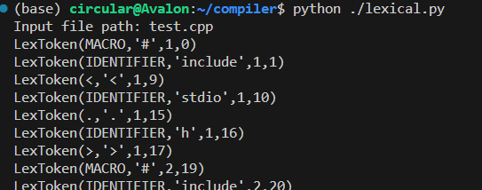
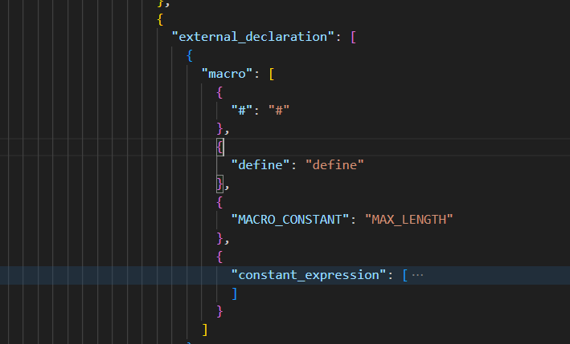

# compiler
朱旭 覃诗睿

## 环境配置
安装ply库用于词法和语法分析
```
pip install ply
```

## 词法分析
利用ply库的lex模块实现词法分析。参考[ply](http://www.dabeaz.com/ply/ply.html)手册。定义token和保留字等参照了[C语言标准文档ISO/IEC 9899:TC3](https://www.open-std.org/jtc1/sc22/wg14/www/docs/n1256.pdf)。
### 创新点
1. 可以忽略两种类型的注释
    ```
    // 注释一
    /* 注释二 */
    ```
2. 加入了宏定义符号识别
    
    识别#,方便后续预编译处理。
    

## 语法分析
利用ply库的yacc模块实现语法分析，并定义结点类用于语法分析树的生成。参考标准等同词法分析部分。值得一提的是，由于大部分编译器并不很好地支持C99标准中的复数（_complex）和虚数(_imaginary)，考虑到实现复杂度以及工作量，我们在语法分析部分没有支持这两个语法。
### 创新点
1. 对宏定义进行了支持
    
    继承词法分析部分的工作，我们对#include和#define两个宏语法进行了识别，并将在后续部分尽可能支持宏替换等。
    
    
### 难点
1. 语法规则对应方法的编写
    
    主要来自于C99标准中对语言描述的Syntax部分。同时还要将原文中描述的一些符号替换为使用的token等，过程整体相当繁琐易错。
2. 抽象语法树json文件的生成
    
    采用了深度优先遍历的方法。

## 小组分工
朱旭：词法分析、语法分析
覃诗睿：测试程序、语义分析